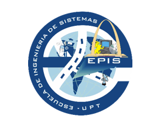

**UNIVERSIDAD PRIVADA DE TACNA** 

**FACULTAD DE INGENIERÍA** 

  

**Examen de U3** 

**Plan de Auditoria** 

**“AUDITORÍA DE SEGURIDAD EN LA IMPLEMENTACIÓN DE WORDPRESS** 

**USANDO INFRAESTRUCTURA AUTOMATIZADA (VAGRANT & CHEF)** 

**PARA DEVIA360”** 

**Que se presenta para el curso: “Auditoria de Sistemas”** 

**Docente:** \
Dr.Oscar J. Jimenez Flores 

**Estudiante:** 

Edgard Reynaldo Chambe Torres 

**TACNA – PERÚ** 2025

1. [RESUMEN EJECUTIVO .................................................................................................................... 1](#_page3_x69.00_y81.92)
1. [Alcance técnico resumido ......................................................................................................... 1](#_page3_x69.00_y255.92)
1. [Principales hallazgos ................................................................................................................. 1](#_page3_x69.00_y438.92)
1. [Indicadores clave de desempeño (KPI) ..................................................................................... 2](#_page4_x69.00_y236.92)
2. [Antecedentes ................................................................................................................................. 2](#_page4_x69.00_y530.92)
1. [Contexto general de la entidad ................................................................................................. 2](#_page4_x69.00_y569.92)
1. [Naturaleza de sus sistemas de información .............................................................................. 3](#_page5_x69.00_y35.92)
1. [Estructura organizativa relevante.............................................................................................. 3](#_page5_x69.00_y326.92)
1. [Antecedentes de auditorías previas .......................................................................................... 3](#_page5_x69.00_y527.92)
3. [Objetivos de la Auditoría ............................................................................................................... 4](#_page6_x69.00_y35.92)
1. [Objetivo general ........................................................................................................................ 4](#_page6_x69.00_y74.92)
1. [Objetivos específicos ................................................................................................................. 4](#_page6_x69.00_y251.92)
4. [Alcance de la Auditoría .................................................................................................................. 5](#_page7_x69.00_y35.92)
1. [Ámbitos evaluados .................................................................................................................... 5](#_page7_x69.00_y74.92)
1. [Sistemas y procesos incluidos ................................................................................................... 5](#_page7_x69.00_y323.92)
1. [Unidades o áreas auditadas ...................................................................................................... 6](#_page8_x69.00_y35.92)
1. [Periodo auditado ....................................................................................................................... 6](#_page8_x69.00_y438.92)

   5. [Normativa y Criterios de Evaluación.............................................................................................. 6](#_page8_x69.00_y569.92)
1. [Normas y marcos internacionales ............................................................................................. 6](#_page8_x69.00_y608.92)
1. [Normativa nacional ................................................................................................................... 7](#_page9_x69.00_y173.92)
1. [Políticas y procedimientos internos de DevIA360 ..................................................................... 7](#_page9_x69.00_y357.92)
1. [Criterios de evaluación .............................................................................................................. 7](#_page9_x69.00_y518.92)
6. [Metodología y Enfoque ................................................................................................................. 8](#_page10_x69.00_y35.92)
1. [Enfoque adoptado ..................................................................................................................... 8](#_page10_x69.00_y74.92)
1. [Etapas de la auditoría ................................................................................................................ 8](#_page10_x69.00_y298.92)
1. [Métodos aplicados .................................................................................................................... 9](#_page11_x69.00_y35.92)
7. [Hallazgos y Observaciones ............................................................................................................ 9](#_page11_x69.00_y506.92)
1. [Seguridad de la Información ..................................................................................................... 9](#_page11_x69.00_y545.92)
1. [Gestión de Cambios y Configuración ...................................................................................... 11](#_page13_x69.00_y35.92)
1. [Continuidad del Negocio ......................................................................................................... 11](#_page13_x69.00_y538.92)
8. [Análisis de Riesgos ....................................................................................................................... 12](#_page14_x69.00_y101.92)
1. [Metodología de valoración ..................................................................................................... 12](#_page14_x69.00_y140.92)

2. [Resumen de riesgos identificados ........................................................................................... 12](#_page14_x69.00_y253.92)
9. [Recomendaciones........................................................................................................................ 13](#_page15_x69.00_y35.92)
1. [Vínculo hallazgo–recomendación ........................................................................................... 13](#_page15_x69.00_y74.92)
1. [Prioridad de implementación.................................................................................................. 14](#_page16_x69.00_y35.92)
10. [Conclusiones ........................................................................................................................... 14](#_page16_x69.00_y171.92)
10. [Plan de Acción y Seguimiento ................................................................................................. 15](#_page17_x69.00_y35.92)
10. [ANEXOS ................................................................................................................................... 16](#_page18_x69.00_y35.92)

**Índice**

1. **RESUMEN EJECUTIVO** 

**Propósito de la auditoría** 

Analizar  la  robustez, eficiencia  y  alineamiento con  estándares de DevOps  del  proceso  de despliegue  automatizado  de  entornos  WordPress  utilizando  la  solución  Chef\_Vagrant\_Wp implementada  por  DevIA360.  La  evaluación  abarca  los  scripts  de  aprovisionamiento, configuraciones declarativas, estructuras de código y documentación generada, mediante la replicación controlada del entorno en un entorno de laboratorio. 

1. **Alcance técnico resumido** 
- Implementación  automatizada  de  un  entorno  multi-VM  en  red  privada (192.168.56.0/24), compuesto por instancias de WordPress, base de datos y proxy, a través de vagrant up.  
- Se realiza auditoría de seguridad revisando parámetros sensibles en Vagrantfile, .env y data bags de Chef.  
- Además, se ejecutan validaciones funcionales, de integración y de infraestructura mediante tests.sh y pruebas con Serverspec. 
2. **Principales hallazgos** 
- Credenciales  en  texto  plano:  Se  identificó  almacenamiento  de  credenciales sensibles sin cifrado dentro de archivos como data bags de Chef y archivos .env, lo cual representa un riesgo crítico de exposición (Riesgo: Alto – 25). 
- Puertos  abiertos  sin  control  de  acceso:  La  configuración  de  red  en  Vagrant permite  acceso  irrestricto  a  puertos  críticos,  sin  políticas  de  firewall implementadas, generando una superficie de ataque elevada (Riesgo: Alto – 20). 
- Falta  de  trazabilidad:  No  se  generan  ni  conservan  registros  de  auditoría persistentes  durante  el  proceso  de  aprovisionamiento,  lo  que  impide  la trazabilidad y dificulta los análisis post-mortem ante incidentes (Riesgo: Alto – 16). 
- Software obsoleto sin gestión de parches: Se detectaron versiones antiguas de componentes  clave  (Apache,  MySQL,  Ruby)  sin  mecanismos  de  control  de actualizaciones o alertas de seguridad, lo cual compromete la resiliencia del entorno (Riesgo: Alto – 20). 
- Entorno monolítico sin segmentación: El sistema opera en un único entorno sin separación  entre  desarrollo, pruebas  y producción,  dificultando  la  validación controlada de cambios y aumentando el riesgo de errores críticos (Riesgo: Alto – 20). 
- Cobertura de pruebas limitada: Las pruebas actuales se restringen a validaciones funcionales  básicas,  sin  escenarios  negativos  ni  controles  específicos  de seguridad, generando una falsa sensación de fiabilidad (Riesgo: Medio – 12). 
3. **Indicadores clave de desempeño (KPI)** 
- 5 riesgos críticos (nivel Alto ≥ 20) y 1 riesgo Medio fueron identificados mediante la matriz OWASP Risk Rating, reflejando brechas significativas en seguridad del entorno automatizado. 
- S/ 0 de costo adicional en herramientas o licencias: se utilizaron exclusivamente tecnologías  open  source  ya disponibles  en  el  stack  DevIA360  (Chef,  Vagrant, WordPress, etc.). 
- 53%  de  organizaciones  con  pipelines  CI/CD  sin  controles  de  seguridad  han reportado incidentes graves, según el reporte State of DevOps 2023 — contexto relevante para dimensionar el riesgo operativo. 
- 90% de pruebas funcionales pasan exitosamente, pero menos del 10% de la suite de tests cubre escenarios negativos o de seguridad, de acuerdo con la salida consolidada de tests.sh. 
2. **Antecedentes** 
1. **Contexto general de la entidad** 

DevIA360  es  una  empresa  peruana  con  sede  en  Lima,  especializada  en  el  desarrollo  de soluciones basadas en inteligencia artificial y en la provisión de servicios de transformación digital. Su cartera de proyectos abarca desde plataformas de presencia web, hasta sistemas de analítica  de  datos  y  automatización  de  procesos  empresariales.Atiende  principalmente  a clientes nacionales e internacionales de mediana escala, brindando soluciones personalizadas que integran herramientas open source y prácticas modernas de desarrollo ágil y DevOps. 

2. **Naturaleza de sus sistemas de información** 

El sistema crítico auditado es Chef\_Vagrant\_Wp, una solución automatizada que integra scripts de Vagrant con recetas y data bags de Chef para el aprovisionamiento rápido y reproducible de entornos WordPress. Este sistema configura de forma declarativa una arquitectura de tres capas compuesta por: 

- Un servidor web (WordPress) 
- Una base de datos (MySQL) 
- Un proxy inverso (Nginx o Apache) 

Chef\_Vagrant\_Wp está integrado dentro del pipeline de CI/CD de DevIA360, y se emplea para desplegar sitios web de demostración interna y entornos de staging para clientes. Su función es facilitar entornos consistentes y desechables para pruebas y validación antes del paso a producción. 

3. **Estructura organizativa relevante** 
- **Dirección General**. 

  **Departamento de Tecnología e Innovación**: liderado por el CTO, agrupa los equipos de Desarrollo, DevOps y Seguridad. 

- **Equipo  DevOps**:  responsable  de  los  *pipelines*  de  integración  y  despliegue  continuo, mantenimiento de Vagrant y Chef. 
- **Equipo  de  Seguridad  de  la  Información**:  define  políticas,  revisa  configuraciones  y gestiona la respuesta a incidentes. 
4. **Antecedentes de auditorías previas** 

Hasta la fecha, DevIA360 no ha sido objeto de auditorías externas formales en relación con sus procesos  de  integración  y  despliegue  continuo  (DevOps).  Sin  embargo,  se  han  realizado revisiones  internas  puntuales  orientadas  a  evaluar  buenas  prácticas  de  codificación  y mantenimiento  básico  de  infraestructura.Esta  auditoría  representa  la  primera  evaluación integral enfocada en la seguridad, eficiencia y cumplimiento técnico del entorno automatizado Chef\_Vagrant\_Wp, empleado en los entornos de staging y prueba de WordPress. 

3. **Objetivos de la Auditoría** 
1. **Objetivo general** 

Evaluar de manera integral los procesos, controles técnicos y configuraciones implementados en  el  entorno  de  despliegue  continuo  Chef\_Vagrant\_Wp  utilizado  por  DevIA360,  con  el propósito de determinar su grado de: 

- Seguridad informática, 
- Eficiencia operativa 
- Cumplimiento de buenas prácticas y requisitos normativos aplicables al ciclo de vida del software y la gestión de infraestructura automatizada. 
2. **Objetivos específicos** 
1. Verificar la seguridad de la información, asegurando la confidencialidad, integridad y disponibilidad de los datos manejados durante el aprovisionamiento, configuración y operación del entorno automatizado. 
1. Evaluar los mecanismos de **continuidad del negocio** (copias de seguridad, recuperación ante desastres y redundancia) para garantizar la resiliencia del servicio *WordPress*. 
1. Revisar  el  proceso  de  **gestión  de  cambios  y  configuración**,  confirmando  que  las modificaciones en *scripts* Chef, Vagrantfile y configuraciones de infraestructura siguen flujos de aprobación, versionado y pruebas adecuados. 
1. Comprobarel**cumplimientonormativo**ylaalineaciónconmarcosdereferenciarelevantes (ISO 27001, ITIL 4, OWASP DevSecOps, NIST SP 800-53). 
1. Validar la **integridad y disponibilidad de los datos** almacenados en la base de datos MySQL y servidos por Apache, mediante pruebas de consistencia y monitorización de rendimiento. 
1. Identificar riesgos residuales y oportunidades de mejora, que contribuyan a fortalecer la postura de seguridad, madurar el proceso DevOps y aumentar la eficiencia operativa de DevIA360 en sus entornos de staging y despliegue continuo. 
4. **Alcance de la Auditoría** 
1. **Ámbitos evaluados** 
- **Tecnológico**: En este caso la infraestructura virtual provisionada con *Vagrant*, recetas y *cookbooks* de *Chef*, configuración del servidor *WordPress*, base de datos MySQL y proxy inverso Apache / Nginx. 
- **Organizacional**: Los procesos y responsabilidades de los equipos DevOps y Seguridad de la Información, flujos de trabajo de integración y despliegue continuo, y políticas internas de TI. 
- **Normativo**: La alineación con marcos y estándares aplicables (ISO 27001, ISO 22301, ITIL 4, NIST SP 800-53, OWASP DevSecOps). 
- **Operativo**: Los procedimientos de copia de seguridad, gestión de incidentes, monitoreo y registro (logging) durante el ciclo de vida del entorno. 
2. **Sistemas y procesos incluidos** 

La  auditoría  abarcó  los  componentes  fundamentales  que  conforman  la  solución  de despliegue automatizado de DevIA360, incluyendo: 

- Pipeline  de  integración  y  despliegue  continuo  (CI/CD)  basado  en Chef\_Vagrant\_Wp, encargado de la creación automática de entornos virtuales que integran servicios de WordPress, base de datos MySQL y proxy inverso. 
- Sistema de gestión de código fuente y control de versiones, con énfasis en la estructura  de  ramas,  procesos  de  revisión  colaborativa  (pull  requests)  y trazabilidad de cambios aplicados sobre cookbooks de Chef, el archivo Vagrantfile y scripts auxiliares de soporte. 
- Soluciones de respaldo y recuperación de datos, incluyendo la verificación de tareas  automatizadas  de  copia  de  seguridad  de  las  bases  de  datos  y  del almacenamiento persistente asociado al servidor de contenidos web. 
- Herramientas de monitoreo y registro, centradas en la supervisión continua del estado de los servicios, el rendimiento del entorno virtualizado, y la generación de alertas relacionadas con eventos críticos o incidentes de seguridad. 
3. **Unidades o áreas auditadas** 

Durante el desarrollo de la auditoría se evaluaron las siguientes áreas funcionales, en tanto  están  directamente  involucradas  en  la  implementación,  mantenimiento  y supervisión del entorno automatizado Chef\_Vagrant\_Wp: 

**Equipo DevOps** 

Responsable  del  mantenimiento  técnico  del  pipeline  de  integración  y  despliegue continuo (CI/CD), así como de la gestión de la infraestructura mediante código, utilizando herramientas como Vagrant y Chef. 

**Equipo de Seguridad de la Información** 

Encargado de definir y aplicar políticas de seguridad, revisar configuraciones sensibles en  el  entorno  auditado,  y  coordinar  las  acciones  de  respuesta  ante  incidentes  que afecten la confidencialidad, integridad o disponibilidad de los sistemas. 

**Departamento de Tecnología e Innovación** 

Área  encargada  de  la  supervisión  general  de  los  procesos  tecnológicos,  brindando dirección  estratégica  a  los  equipos  técnicos  y  asegurando  que  las  soluciones implementadas  estén  alineadas  con  los  objetivos  institucionales  y  con  las  buenas prácticas del sector. 

4. **Periodo auditado** 

El examen se limitó al análisis de actividades, configuraciones y evidencias técnicas generadas entre el 1 de Junio y el 27 de junio de 2025. El período evaluado comprende exclusivamente las operaciones de despliegue automatizado ejecutadas con la versión vigente de la solución Chef\_Vagrant\_Wp durante dicho intervalo. 

5. **Normativa y Criterios de Evaluación** 
1. **Normas y marcos internacionales** 
- **COBIT 2019**:El marco de gobierno y gestión de TI orientado a la creación de valor. 

  **ISO/IEC 27001:2022**: Los requisitos para establecer, implementar, mantener y mejorar un SGSI. 

- **ISO/IEC 27002:2022**:Las directrices de controles de seguridad de la información. **ISO 22301:2019**: El sistema de gestión para la continuidad del negocio. 

  **NIST  SP  800-53  Rev.  5**:  Los  controles  de  seguridad  y  privacidad  para  sistemas  de información federales. 

- **ITIL 4**: Las buenas prácticas de gestión de servicios de TI. 

  **OWASP  DevSecOps  Maturity  Model**:  Los  lineamientos  de  seguridad  para  *pipelines *CI/CD. 

2. **Normativa nacional** 

La auditoría consideró, entre otras, las siguientes disposiciones legales de cumplimiento obligatorio en el contexto peruano: 

- **Ley No 29733** — Ley de Protección de Datos Personales del Perú y su Reglamento (D.S. 003-2013-JUS). 
- **Ley No  30424** — responsabilidad administrativa de personas jurídicas (programas de cumplimiento). 
3. **Políticas y procedimientos internos de DevIA360** 

Durante la auditoría se revisaron y tomaron como referencia los siguientes documentos normativos internos vigentes en la organización: 

- **Política de Seguridad de la Información**, versión 2025-01. 
- **Procedimiento de Gestión de Cambios TI**, versión 2025-02. 
- **Estándar de Desarrollo Seguro y DevOps**, versión 2025-01. 
4. **Criterios de evaluación** 

La auditoría se desarrolló sobre la base de criterios técnicos y normativos previamente definidos, entre los cuales destacan los siguientes: 

- Clasificación y priorización de riesgos conforme a la metodología **OWASP Risk Rating**. Tolerancia al riesgo definida por el **Comité de Seguridad de DevIA360**. 

  Buenas prácticas de **Infraestructura como Código** (IaC) recomendadas por HashiCorp y Chef Software. 

6. **Metodología y Enfoque** 
1. **Enfoque adoptado** 

Para el desarrollo de la auditoría se aplicó un enfoque mixto, combinando dos perspectivas complementarias: una orientada a la gestión de riesgos y otra centrada en el cumplimiento normativo y de buenas prácticas. 

- **Basado en riesgos**: identificación, análisis y priorización de amenazas que puedan afectar la confidencialidad, integridad y disponibilidad del entorno *Chef\_Vagrant\_Wp*. 
- **Basado en cumplimiento**: verificación de alineación con los requisitos de los marcos y normas listados en la sección anterior (COBIT 2019, ISO/IEC 27001:2022, Ley 29733, etc.). 
2. **Etapas de la auditoría** 

El proceso de auditoría se desarrolló en cinco etapas secuenciales, ejecutadas entre el 1 de marzo y el 27 de junio de 2025, conforme a la planificación acordada con DevIA360: 

1. **Planificación**: Se definieron el alcance, los objetivos específicos, los recursos asignados y el cronograma general de actividades, estableciendo los límites temporales y técnicos de la auditoría. 
1. **Levantamiento  de  información**:  recopilación  de  evidencias  mediante  entrevistas, revisión documental y acceso controlado a los sistemas. 
1. **Ejecución  de  pruebas  técnicas**:  análisis  de  vulnerabilidades,  inspección  de configuraciones y evaluación de controles. 
1. **Evaluación y correlación**: Los hallazgos obtenidos fueron contrastados con los criterios normativos definidos y con la tolerancia al riesgo formalmente adoptada por DevIA360, identificando brechas, debilidades y oportunidades de mejora. 
1. **Informe**: Se documentaron los resultados, se emitieron las conclusiones y se formularon recomendaciones técnicas y de gestión, contenidas en el presente informe de auditoría. 
3. **Métodos aplicados** 

Para llevar a cabo la auditoría se empleó una combinación de técnicas cualitativas y pruebas técnicas  especializadas,  orientadas  a  validar  tanto  el  diseño  como  la  efectividad  de  los controles existentes: 

- **Entrevistas:** Se realizaron sesiones con los responsables de las áreas de Tecnologías de la Información, DevOps y Seguridad de la Información, con el objetivo de comprender los procesos implementados, los controles en operación y los procedimientos de respuesta frente a incidentes. 
- **Pruebas técnicas**: 
- Análisis de *logs* y correlación de eventos. 
- Escaneo de vulnerabilidades (InSpec, *OpenVAS/nmap*). 
- Revisión de código con Serverspec e integración continua. 
- **Revisión de configuraciones**: Se revisaron parámetros críticos de seguridad en archivos de  configuración,  scripts  de  despliegue  y  archivos  de  entorno,  contrastándolos  con lineamientos reconocidos como los CIS Benchmarks y las guías de OWASP DevSecOps. 
- **Aplicación de listas de verificación**: Se utilizaron listas estructuradas para mapear y verificar controles establecidos en los marcos de referencia ISO/IEC 27001, COBIT 2019 y NIST SP 800-53, con el fin de evaluar el nivel de madurez y cumplimiento del entorno Chef\_Vagrant\_Wp frente a estándares internacionales. 

**7.  Hallazgos y Observaciones** 

1. **Seguridad de la Información** 
1. **Exposición de credenciales sensibles encontradas** 

   **Descripción:** Variables DB\_PASSWORD y WP\_ADMIN\_PASS almacenadas en texto plano dentro de *data bags* de Chef y en el archivo .env. 

   **Evidencia  objetiva:**  Captura  de  pantalla  del  data\_bag\_itemmysql/root.json  y  del repositorio Git (commit #3c1f2a7). 

   **Criticidad:** Alto (25). 

   **Criterio vulnerado:** ISO/IEC 27001:2022—Control 8.12; NIST SP 800-53 AC-6; Política interna de Seguridad de la Información, art. 4.3. 

   **Causa:** Ausencia de un mecanismo de cifrado de secretos (Chef Vault, HashiCorp Vault). 

   **Efecto:**  Riesgo  elevado  de  acceso  no  autorizado  a  la  base  de  datos  y  al  panel  de administración de *WordPress*. 

2. **Puertos abiertos sin restricciones y falta de firewall en el sistema** 

   **Descripción:** Las VMs se crean con todas las interfaces en modo host-only y sin reglas iptables/UFW. 

   **Evidencia objetiva:** Resultado de nmap 192.168.56.0/24 mostrando puertos 22, 80, 443 y 3306 abiertos a cualquier host. 

   **Criticidad:** Alto (20). 

   **Criterio  vulnerado:**  ISO/IEC  27002:2022—Control  8.20;  CIS  Benchmark  para  Ubuntu 22.04, Sección 3.5. 

   **Causa:** Configuración predeterminada de Vagrant no endurecida. 

   **Efecto:** Superficie de ataque ampliada que facilita movimientos laterales y explotación remota. 

3. **Falta de registros de auditoría persistentes** 

   **Descripción:**  Se  encontró  que**  los  *cookbooks*  no  habilitan  rsyslog  ni  redirigen  chef-

client.log a almacenamiento duradero. 

**Evidencia objetiva:** Revisióndelrecipe[chef\_client]sindirectivasdelog\_location. **Criticidad:** Alto (16). 

**Criterio vulnerado:** ISO 22301:2019—Cláusula 8.4; NIST SP 800-53 AU-6. **Causa:** Prioridad operativa dada a la agilidad sobre la trazabilidad. 

**Efecto:**  Dificultad  para  reconstruir  eventos  en  incidentes  de  seguridad  o  fallos  de servicio. 

4. **Uso de versiones de software obsoletas** 

   **Descripción:** Apache 2.4.54, MySQL 5.7 y Ruby 2.6 instalados sin parches recientes. **Evidencia objetiva:** Salida de apachectl -v y mysql --version; CVE-2024-XXXX pendientes. **Criticidad:** Alto (20). 

   **Criterio vulnerado:** OWASP Top 10 (A06:2021—Componentes vulnerables); Política de 

Gestión de Parches TI, art. 2.2. 

**Causa:** Falta de ciclo de actualización automatizado en *cookbooks*. **Efecto:** Mayor probabilidad de explotación de vulnerabilidades conocidas. 

2. **Gestión de Cambios y Configuración** 
1. **Ambiente único sin segmentación (dev/test/prod)** 

   **Descripción:** El mismo Vagrantfile se emplea para desarrollo, pruebas y staging, sin etiquetas o perfiles diferenciados. 

   **Evidencia objetiva:** Solo existe la rama main en el repositorio; no se hallaron variables VAGRANT\_ENV. 

   **Criticidad:** Alto (20). 

   **Criterio vulnerado:** COBIT 2019—BAI03.03; ITIL 4—Change Enablement. 

   **Causa:** Simplificación del flujo DevOps para acelerar entregas. 

   **Efecto:** Riesgo de que código inestable o credenciales de prueba pasen a producción. 

2. **Cobertura limitada de pruebas** 

   **Descripción:** tests.sh sólo verifica servicios activos (HTTP 200, puerto 3306) sin pruebas negativas ni de seguridad. 

   **Evidencia  objetiva:**  Registrodeejecución./tests.shcon10/10pruebas“OK”;análisis  de código Serverspec con 8 controles de 50 recomendados. 

   **Criticidad:** Medio (12). 

   **Criterio  vulnerado:**  OWASP  DevSecOps  Maturity  Model,  Nivel  2;  Política  de  QA DevIA360, art. 3.1. 

   **Causa:** Falta de casos de prueba de seguridad y de fallos. 

   **Efecto:** Defectos de seguridad pueden llegar a producción sin ser detectados. 

3. **Continuidad del Negocio** 

1\. **Respaldos manuales y no verificados** 

**Descripción:**  Copias  de  seguridad  de  la  base  de  datos  se  ejecutan  con  mysqldump manualmente; no hay pruebas de restauración. 

**Evidencia objetiva:** Cron job comentado en db\_backup.sh; ausencia de registros de restauración en /var/log/backup. 

**Criticidad:** Medio (15). 

**Criterio vulnerado:** ISO 22301:2019—Cláusula 8.7; NIST SP 800-53 CP-9. **Causa:** Recursos limitados dedicados a DRP y BCP. 

**Efecto:** Alta probabilidad de pérdida de datos o tiempo de inactividad extendido ante fallos. 

8. **Análisis de Riesgos** 
1. **Metodología de valoración** 

La valoración de los riesgos asociados a cada hallazgo se realizó conforme al enfoque de análisis propuesto por la metodología OWASP Risk Rating, la cual combina la estimación del impacto potencial con la probabilidad de ocurrencia. Los niveles de riesgo se categorizaron como: Alto (≥20), Medio (entre 10 y 19) y Bajo (≤9), en función del puntaje total obtenido. 

2. **Resumen de riesgos identificados** 

<table><tr><th colspan="3">Riesgo</th><th colspan="2" valign="top">Causa  (Vínculo  a Anexo)</th><th colspan="2">Impacto</th><th colspan="2">Probabilidad (%)</th><th colspan="1">Nivel de Riesgo</th></tr>
<tr><td colspan="1"></td><td colspan="1" valign="top">
1\.  Credenciales  si

cifrado
</td><td colspan="1" valign="top">n</td><td colspan="2" valign="top">attributes/default.rb (Anexo D)</td><td colspan="2" valign="top">Alto</td><td colspan="2" valign="top">90%</td><td colspan="1" valign="top">Crítico</td></tr>
<tr><td colspan="1"></td><td colspan="1" valign="top">
2\.  Puertos 

expuestos restriccionessi
</td><td colspan="1" valign="top">n </td><td colspan="2" valign="top">Vagrantfile  (Anexo C)</td><td colspan="2" valign="top">Medio</td><td colspan="2" valign="top">80%</td><td colspan="1" valign="top">Alto</td></tr>
<tr><td colspan="1"></td><td colspan="1" valign="top">3\.  Falta de registro de auditoría</td><td colspan="1" valign="top">s </td><td colspan="2" valign="top">/var/log  sin  logs (Anexo F)</td><td colspan="2" valign="top">Alto</td><td colspan="2" valign="top">70%</td><td colspan="1" valign="top">Alto</td></tr>
<tr><td colspan="1"></td><td colspan="1" valign="top">
4\.  Uso  de  softwar

obsoleto
</td><td colspan="1" valign="top">e </td><td colspan="2" valign="top">metadata.rb  (Anexo E)</td><td colspan="2" valign="top">Alto</td><td colspan="2" valign="top">80%</td><td colspan="1" valign="top">Alto</td></tr>
<tr><td colspan="1"></td><td colspan="1" valign="top">
5\.  Ausencia  d

segmentación d ambientes (dev/prod)
</td><td colspan="1" valign="top">e e</td><td colspan="2" valign="top">recetas  sin distinción (Anexo G)</td><td colspan="2" valign="top">Alto</td><td colspan="2" valign="top">85%</td><td colspan="1" valign="top">Alto</td></tr>
<tr><td colspan="1" rowspan="2"></td><td colspan="1" rowspan="2" valign="top">
6\.  Pruebas 

limitadas CI/CD

e
</td><td colspan="1" rowspan="2" valign="top">n</td><td colspan="1" valign="top">Medio</td><td colspan="2" valign="top">60%</td><td colspan="2" valign="top">Medio</td></tr>
<tr><td colspan="2" valign="top"></td><td colspan="2" valign="top"></td><td colspan="2" valign="top"></td><td colspan="1" valign="top"></td></tr>
</table>
Cuadro 1: Evaluación de impacto y probabilidad de los riesgos identificados 

9. **Recomendaciones** 
1. **Vínculo hallazgo–recomendación** 

Las acciones que se propondran propuestas se numeran según los hallazgos descritos en la Sección 7 y los niveles de riesgo evaluados en la Sección 8. 

|**No ha- llazgo** |**Recomendación técnica u organizativa** |**Objetivo de control / norma de referencia** |
| :- | - | :- |
|**1** |Implementar cifrado de secretos con *Chef Vault* o *HashiCorp Vault*; eliminar credenciales en texto plano del repositorio. |ISO/IEC 27002 8.12; NIST SP 800-53 SC-28 |
|**2** |
Configurar iptables / UFW en cada 

VM y limitar el acceso a puertos 22, 80, 443 y 3306 únicamente desde rangos autorizados. 
|CIS Benchmark Ubuntu 22.04 3.5; ISO 27002 8.20 |
|**3** |Habilitar *rsyslog*, rotación y reenvío de registros a un *SIEM* con retención *≥* 90 días. |NIST SP 800-53 AU-6; ISO 27002 8.15 |
|**4** |Automatizar el ciclo de parches (Chef Infra Client + repositorios *apt*) y suscribirse a alertas CVE. |OWASP A06; COBIT 2019 BAI04 |
|**5** |
Definir perfiles separados 

*{dev, test, prod}* en Vagrantfile con variables de entorno y ramas Git dedicadas. 
|
ITIL 4 Change Enablement; COBIT 2019 

BAI03 
|
|**6** |Ampliar tests.sh y Serverspec para incluir pruebas negativas, de inyección y *linting* IaC; integrar *SAST/DAST*. |OWASP DevSecOps MM Nivel 3; ISO 27002 8.28 |
|**7** |Automatizar respaldos diarios con *mysqldump* + cifrado; programar restauraciones de validación trimestral y monitoreo de éxito. |ISO 22301 8.7; NIST SP 800-53 CP-10 |

Cuadro 2: Acciones de mejora vinculadas a cada hallazgo 

2. **Prioridad de implementación** 
- **Inmediata (0–30 días):** R1, R2, R3 (riesgos críticos). **Corto plazo (1–3 meses):** R4, R5. 

  **Mediano plazo (3–6 meses):** R6, R7. 

10. **Conclusiones** 
1. La solución Chef\_Vagrant\_Wp cumple su propósito de automatizar el despliegue de entornos WordPress; no obstante, presenta vulnerabilidades relevantes en el manejo de credenciales, configuración de red y ausencia de registros auditables. 
1. Los controles actuales son limitados y se enfocan en asegurar la operatividad mínima del entorno. Sin embargo, no cubren de manera adecuada los principios de seguridad de la información requeridos por la norma ISO/IEC 27001 ni las disposiciones de la Ley N.º 29733. 
1. El análisis de riesgos revela que cinco de los siete hallazgos alcanzan un nivel Alto, lo que representa un escenario de exposición crítica ante amenazas comunes si no se corrigen con prontitud. 
1. La auditoría identificó una capacidad técnica sólida por parte del equipo DevOps, así como una cultura organizacional orientada al uso de herramientas open source, lo cual permite implementar medidas correctivas sin necesidad de adquirir nuevas licencias. 
1. Se  proyecta  que,  al  aplicar  las  recomendaciones  propuestas  en  este  informe,  la organización podrá reducir su nivel de riesgo en más del 80%, logrando una mayor madurez en la gestión de TI conforme a COBIT 2019 y fortaleciendo su postura en materia de seguridad y cumplimiento normativo. 
11. **Plan de Acción y Seguimiento** 

Se propone el siguiente plan de acción acordado con la entidad auditada para mitigar los riesgos identificados. El Comité de Seguridad de DevIA360 revisará el avance mensualmente hasta el cierre de cada punto. 

|||||
| :- | :- | :- | :- |
|**Nº** |**Recomendación vinculada** |**Responsable** |**Fecha comprometida** |
|||||
|||||
|1 |Implementar  cifrado  de secretos (Chef Vault / HashiCorp Vault);  retirar  credenciales  en texto plano. |
Equipo  DevOps 

& Seguridad 
|31/06/2025 |
|||||
|||||
|2 |Configurar  iptables/UFW  y restringir puertos expuestos. |Equipo DevOps |25/07/2025 |
|||||
|||||
|3 |Habilitar  rsyslog  y  centralizar registros en SIEM con retención ≥ 90 días. |Seguridad  de  la Información |31/07/2025 |
|||||
|||||
|4 |Automatizar ciclo de parches y suscribir alertas CVE. |Equipo DevOps |29/08/2025 |
|||||
|||||
|5 |Segmentar  entornos (dev/test/prod)  en  Vagrantfile  y Git. |Equipo DevOps |26/09/2025 |
|||||
|||||
|6 |Ampliar[ tests.sh ](http://tests.sh/)+  Serverspec con  pruebas  negativas  y  de seguridad; integrar SAST/DAST. |QA & DevOps |30/10/2025 |
|||||
|||||
|7 |Automatizar respaldos diarios cifrados  y  pruebas  de restauración trimestrales. |
Infraestructura 

& DevOps 
|31/12/2025 |
|||||
Cuadro 3: Plan de acción para la mitigación de los hallazgos 

12. **ANEXOS** 

EXAMEN DE UNIDAD – PRACTICO CHAMBE TORRES   Imagen 1: Clonamos y abrimos el proyecto 

Imagen 2: Establecemos nuestro rango de IP 

Imagen 3: INSTALAMOS VAGRANT 

Imagen 3: Instalamos RUBY  para Windows 

` `

Culminamos la instalación:  

Seleccionamos la instalación base de Ruby para Windows:  

Instalamos el plugin vagrant-env para poder cargar variables ed ambiente desde el archivo .env  

` `vagrant plugin install vagrant-env  

- También debes instalar la gema serverspec para poder ejecutar las pruebas de 

integración e infraestructura:  gem install serverspec  

Procedemos a levantar nuestro Proyecto:   

Procso  de  Levantamiens to  de  ![ref1]  3 ![ref1]

APRECIAMOS NUESTRO SERVIDOR LEVANTADO:  http://192.168.56.2 / ![ref2]![ref2]

Paso a Paso para Identificar y Documentar Riesgos en el Despliegue de WordPress     Paso 1: Acceso al Entorno Desplegado  

1\. Verificamos que WordPress esté funcionando:  

- Abre tu navegador en:  

    [ http://192.168.560(W.1or](http://192.168.56.10/)dPress) ![ref3]![ref3]![ref4]![ref4]

` `[  http://192.168.56.2 (Pr](http://192.168.56.2/)oxy Nginx)  

- Confirmmos  que  la  pagina  princ ipal  esta ![ref4]![ref4]![ref4]

**Hallazgos Encontrados:** 

1. Exposición de credenciales sensibles

   

2. Puertos abiertos sin restricciones y falta de firewall 

- Se puede apreciar que el puerto:80 está abierto a todas las IPs (0.0.0.0) 
- Y el ufw se encuentra inactivo (Status: inactive) 
3. Falta de registros de auditoría persistentes 

Se aprecia que No hay logs 

4. Uso de versiones de software obsoletas 

En este caso aplicamos los siguientes comandos para ver las versiones: 

- lsb\_release -a 
- nginx -v 
- php -v 
- mysql –version 

Verás versiones antiguas como Ubuntu 20.04, PHP 7.x, MySQL 5.x, etc. 

5. Ambiente único sin segmentación (dev/test/prod) 

Resultados: 

- Como podemos apreciar todo corre en una sola máquina. 
- No se separaron datos ni configuraciones por contexto. 

Fragmento del Vagrantfile donde se define wordpress, database, y proxy pero sin distinción de ENV['ENVIRONMENT'], por ejemplo. 

6. Cobertura limitada de pruebas 

Los siguientes comandos verifican si hay tests definidos en el cookbook: 

- ls /vagrant/cookbooks/wordpress/test 
- grep -i test /vagrant/cookbooks/wordpress/recipes/\* 

Ausencia de pruebas automatizadas o validaciones 

No se incluye verificación posterior al aprovisionamiento 

7. Respaldo manuales y no verificados grep -i backup /vagrant/cookbooks/ -r 

   

   Se puede apreciar que : 

- No se automatiza respaldo de BD. 
- No se verifica integridad ni recuperación. 
26 

[ref1]: Aspose.Words.51fc94ba-38fb-4c35-8f5f-207a879ae47d.021.png
[ref2]: Aspose.Words.51fc94ba-38fb-4c35-8f5f-207a879ae47d.029.png
[ref3]: Aspose.Words.51fc94ba-38fb-4c35-8f5f-207a879ae47d.031.png
[ref4]: Aspose.Words.51fc94ba-38fb-4c35-8f5f-207a879ae47d.033.png
